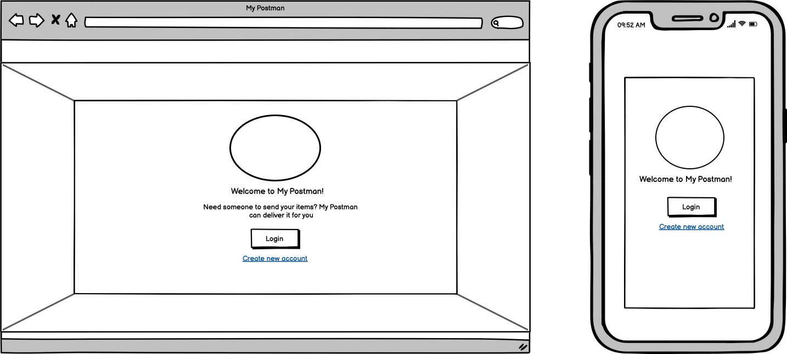
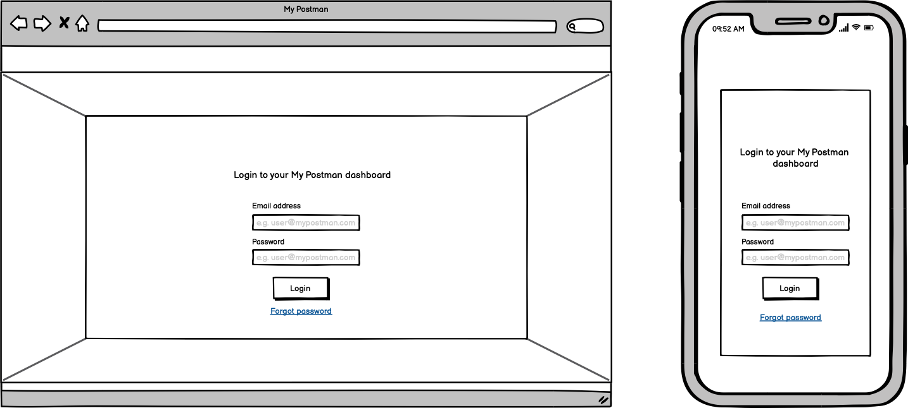
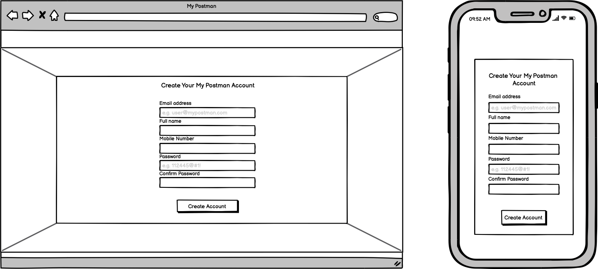
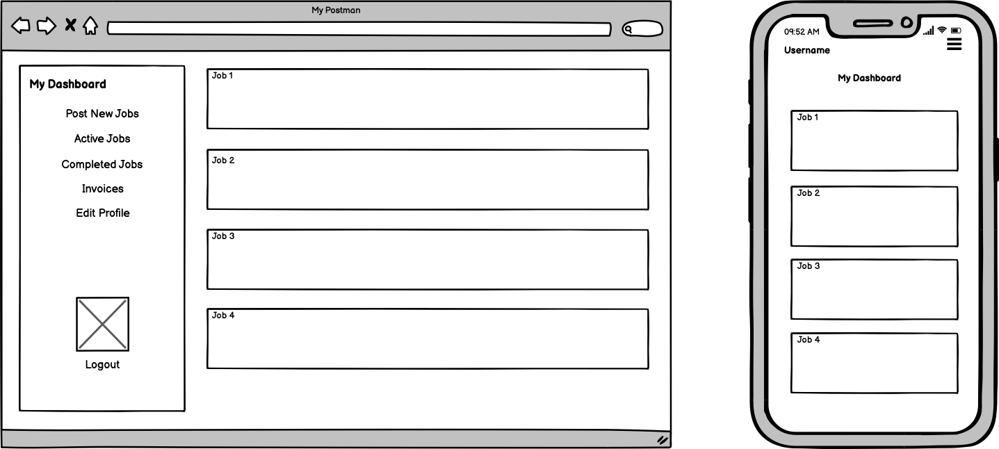

# MY POSTMAN

##### Trello Board
Link : https://trello.com/b/6HZMr3us/mypostman

## Overview
***
This app will be a marketplace to meet between people who is seeking a logistic service and logistic service provider. User will have the capability to post a job for public that will be displayed on the dashboard or assigned  the job to a particular logistic provider. As logistic provider, they will have the capabilities to browse through dashboard, accept and decline jobs.

Example, you want to send a document to your client. You can simply post a job to the app and it will make it visible to logistic provider to take on the job by accepting the job request.

## Wireframes
***

Known missing wireframes:
- Post job page

#### Landing page
Landing page is the page where all user will be directed to when they are not logged in. It should engaging and represent the purpose of the application. It will includes a login button and signup link.

#### Login and Signup page
When the user click login, it will prompt to the login form. The user enters their credentials and is then directed to the dashboard page. If user click on create new account link, the user will need to sign up and then they will be directed to the dashboard page.
 

#### Dashboard page
Dashboard page is specific to each user. Its features are:
- Shows the active jobs
- Shows the completed jobs
- Button to post new jobs
- Invoices
- Edit profile button
- Logout button

