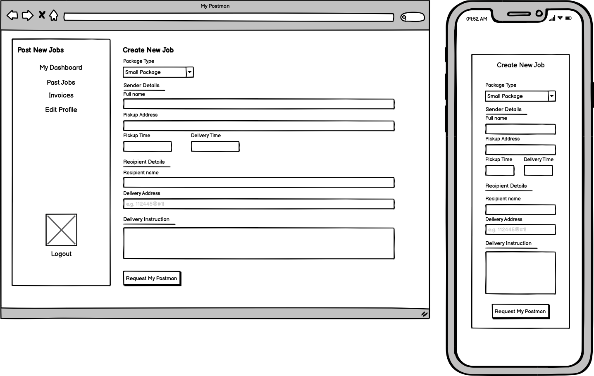

# MY POSTMAN

##### Trello Board
Link : https://trello.com/b/6HZMr3us/mypostman

## Overview
***
This app will be a marketplace to meet between people who is seeking a logistic service and logistic service provider. User will have the capability to post a job for public that will be displayed on the dashboard or assigned  the job to a particular logistic provider. As logistic provider, they will have the capabilities to browse through dashboard, accept and decline jobs.

Example, you want to send a document to your client. You can simply post a job to the app and it will make it visible to logistic provider to take on the job by accepting the job request.

## Wireframes
***
#### Landing page
Landing page is the page where all user will be directed to when they visit the site and are not logged in. It should be engaging and represent the purpose of the application. It will includes a login button and signup link.

#### Login and Signup page
When the user click login, it will prompt to the login form. The user enters their credentials and is then directed to the dashboard page. If user click on create new account link, the user will need to sign up and then they will be directed to the dashboard page.
 

#### Dashboard page
Dashboard page is specific to each user. There are two views of dashboard: Service seeker and Logistic provider. It will displays their recent activities and allow the user to access different features. The features included in dashboard are:
- Display last 4 recent activities (by default)
- Shows the active jobs (Logistic provider)
- Shows the completed jobs (Logistic provider)
- Button to post new jobs (Service seeker)
- View jobs (All user)
- Shows past jobs (Service Seeker)
- Invoices (All user)
- Edit profile button (All user)
- Logout button (All user)

##### Dashboard - Service Seeker View

##### Dashboard - Logistic Provider View

#### Profile page
Once created an account, the user will have a profile page. It will display all the data provided and enable the user to edit / update their account.

#### Post New Jobs page
Service seeker will have the ability to post a new job. It will redirect the user to Post New Jobs page where the user need to fill in a form. Request My Postman button will post the jobs and available to view by the logistic provider.

#### View Jobs page
The view jobs page will show details of each jobs posted. Service seeker and Logistic provider will have different views.

##### Service Seeker View
The service seeker view will allow user to overview the job they have posted. User is enabled to edit the job details until a postman (logistic_provider) grab the job.

##### Logistic Provider View
Logistic provider view, showing the job details and will have two buttons at the end of the page, Grab The Job and Completed Job buttons. User need to grab the job first before enable to completed the job. Therefore, completed job button is disabled by default.
